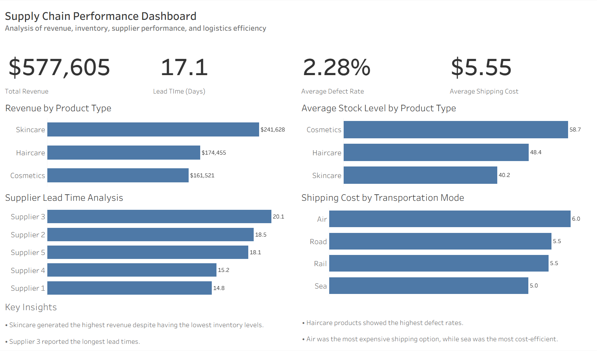

# Supply Chain Performance Analysis

## Project Overview

I built this project to explore how different parts of the supply chain affect overall business performance.

Using Python, SQL, and Tableau, I analyzed inventory levels, supplier performance, manufacturing quality, and logistics costs to identify areas where operational improvements could be made.

The project focuses on answering a simple question:

**Where are the biggest inefficiencies in the supply chain?**

---

## Dataset

The dataset contains information related to:

- Product categories
- Revenue generation
- Inventory levels
- Supplier performance
- Manufacturing operations
- Defect rates
- Shipping costs
- Transportation methods

The dataset includes 100 records and 24 variables, with no missing values.

---

## Tools Used

- Python
- Pandas
- Matplotlib
- SQL
- Tableau Public
- Git
- GitHub

---

## Analysis Process

The project was completed in the following stages:

1. Data Quality Assessment
2. Exploratory Data Analysis (EDA)
3. Revenue Analysis
4. Inventory Analysis
5. Supplier Performance Analysis
6. Manufacturing Quality Analysis
7. Logistics Analysis
8. Dashboard Development

---

## Key Findings

### Skincare Products Generated the Most Revenue

Skincare products generated approximately **$241.6K** in revenue, outperforming both haircare and cosmetics.

### Inventory Levels Did Not Match Product Performance

One of the most interesting findings was that skincare products generated the highest revenue while maintaining the lowest average inventory levels.

This suggests that inventory allocation may not be fully aligned with product demand.

### Supplier Performance Was Generally Stable

Supplier 3 reported the longest average lead times, while Supplier 1 showed the strongest overall performance with both lower lead times and lower defect rates.

### Haircare Products Showed Higher Defect Rates

Haircare products recorded the highest average defect rates among all product categories.

Although the differences were relatively small, this category may present opportunities for quality improvement.

### Air Transportation Was the Most Expensive Option

Air transportation had the highest average shipping costs, while sea transportation offered the lowest shipping costs in the dataset.

---

## Dashboard

### Interactive Tableau Dashboard

[View Interactive Dashboard](https://public.tableau.com/views/Supply_chain_performance_tableau/SupplySupplyChainPerformanceDashboardAnalysisDashboard)

### Dashboard Preview


---

## Business Recommendations

Based on the analysis, several opportunities for improvement were identified:

- Review inventory allocation to better align stock levels with demand.
- Monitor suppliers with longer lead times.
- Investigate quality improvement opportunities within the haircare category.
- Balance transportation choices based on both delivery requirements and shipping costs.

---

## Repository Structure

```text
Supply-Chain-Performance-Analysis/

├── data/
├── notebooks/
├── sql/
├── dashboard/
├── images/
└── README.md
```

---

## Author

**Fernando Gonzalez**

Mechanical Engineer transitioning into Data Analytics, with a strong interest in business intelligence, operations analytics, and data visualization.

This project was created to strengthen my skills in Python, SQL, Tableau, and supply chain analytics through hands-on analysis and dashboard development.
